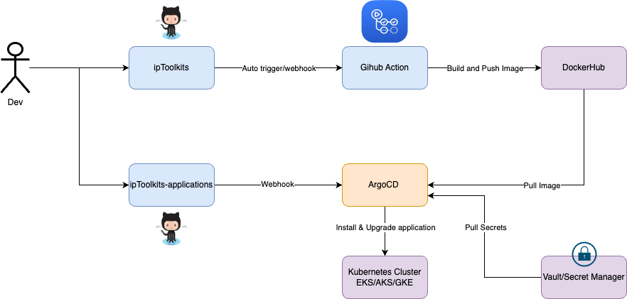

# Overview

I use Github Action for CI and ArgoCD for CD.

Each application (service) has 2 parts:

- Source code: we keep the source code, and CI definitions in its repo.

- K8S service definitions: In order to deploy to K8S, each application need a definition, here we’re using Helm as template engine. These Helm charts, we manage them in a single repo [ipToolkits-applications](https://github.com/naviat/ipToolkits-applications). Whenever you want to increase/decrease resource, or change configuration variables of an application, you can make modification there and send PR to DevOps to review.

## CI - How to trigger deployments?

I have some basic steps for standard CI pipeline, including lint, unit test ... beside of step to build docker image and scan docker image before push to registry.
In the production environment we should to add some step like SonarQueue to report the code coverage.

In order to trigger deployment to Staging, just merge the code to master / main branch after reviewing and testing carefully.

In order to deploy to other non-prod environments, just tag `{env}.{year}.{week}.{deployment_number}`

To deploy to Production, use tag `{project_name}.{year}.{week}.{deployment_number}`

| Env       | How to trigger CI                                |
|-----------|--------------------------------------------------|
| Dev       | Merge PR to main branch                          |
| Sandbox   | In main branch                                   |
|           | `git tag sandbox.2024.16.1`                      |
|           | `git push origin sandbox.2024.16.1`              |
| Production| In main branch                                   |
|           | `git tag iptools.2024.16.1`                      |
|           | `git push origin iptools.2024.16.1`              |

## ArgoCD

I will use localhost ArgoCD as is, this deployment will go with this repository.
