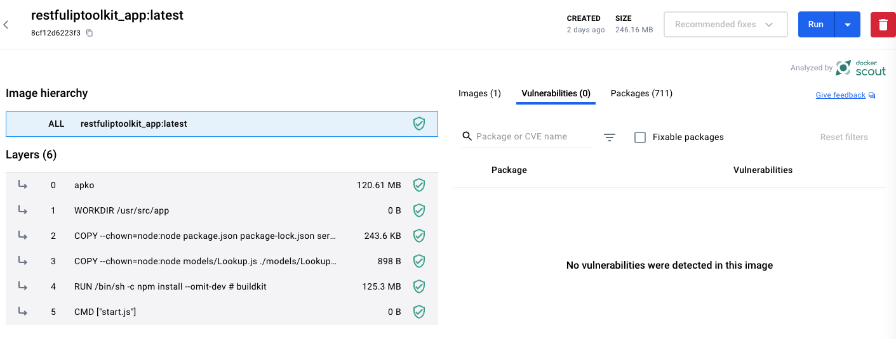
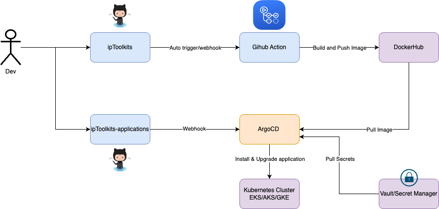
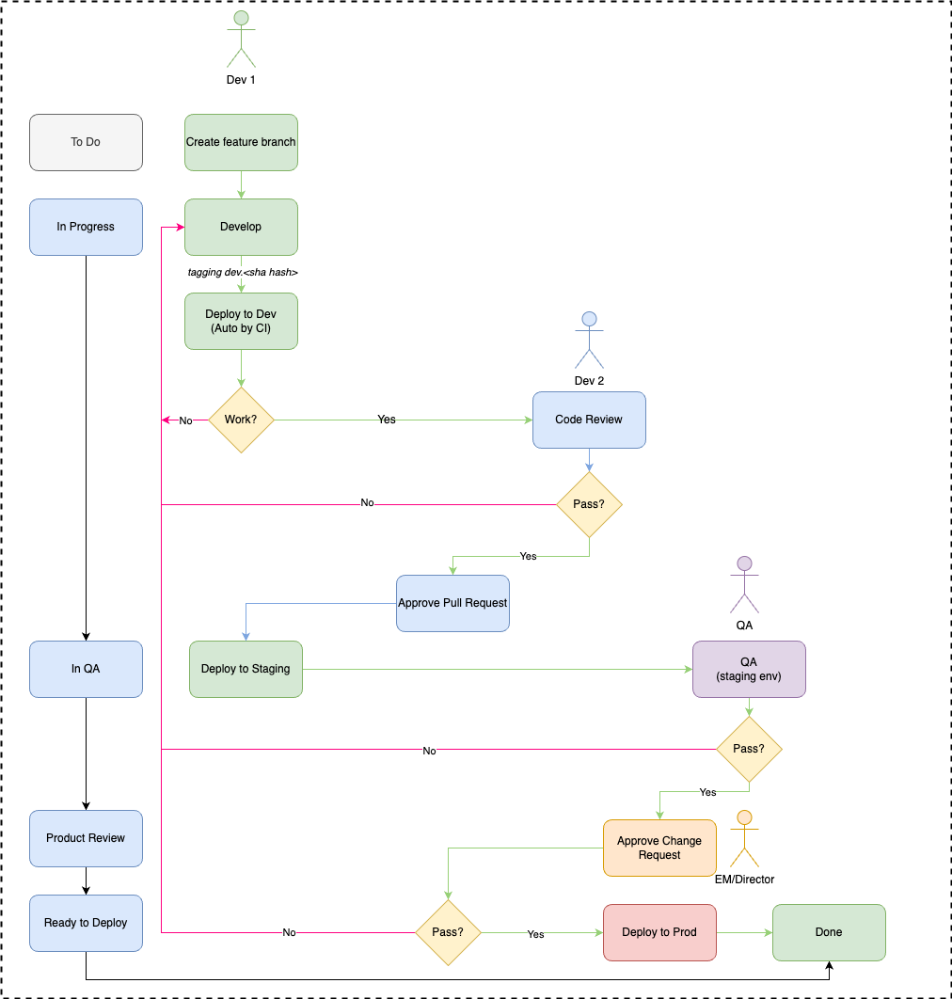

# Infrastructure Directory

# Table of contents

1. [Docker](#docker)
2. [GitOps with Helm and ArgoCD](#gitops-with-helm-and-argocd)
    1. [Helm Charts Repository](#helm-charts-repository)
    2. [Continuous Deployment with ArgoCD and ArgoCD Image Updater](#continuous-deployment-with-argocd-and-argocd-image-updater)
       1. [Integration of ArgoCD Image Updater](#integration-of-argocd-image-updater)
       2. [Managing Dependencies](#managing-dependencies)
3. [Terraform](#terraform)
   1. [Monitoring](#montioring)
4. [Local Testing Using Docker Compose](#local-testing-using-docker-compose)
   1. [Steps to Run Locally](#steps-to-run-locally)

This file contains all necessary configurations and definitions for setting up and maintaining my application's infrastructure using industry best practices in Docker, Kubernetes, and continuous integration/continuous deployment (CI/CD) workflows (Terraform part for provisioning cluster is not included).

- ArgoCD: <https://argocd.localhost> with GitHub (make sure to add [GitHub OAuth app](https://www.infracloud.io/blogs/enabling-sso-authentication-argo-cd/) and update your `.env` file)
- Grafana: <https://monitoring.localhost> with default credentials: `admin/prom-operator`

## Docker

This application uses 2 ways to build Docker images

- **By [Wolfi](https://github.com/wolfi-dev) docker based**, a security-first, minimal base image (`Dockerfile`). These images are designed to provide a secure foundation, minimizing vulnerabilities that are common in more bloated base images. There is no CVE for this docker image.

- **By multi-stage docker image**, build from scratch with `Dockerfile.scratch`. If you want to build from scratch, use `docker-compose.scratch.yml` and run `docker-compose  -f docker-compose.scratch.yml up --build`



## GitOps with Helm and ArgoCD

- I use GitOps to deploy this application according to the following diagram:



- For the deployment process, I divided it into multiple environments as illustrated in the model below:



### Helm Charts Repository

I manage the deployment configurations of this application using Helm charts. These charts are stored in a separate [Git repository] to separate code from configuration and to enhance security and maintainability. We are plan to deploy 4 helm charts:

- Argo Image Updater
- MongoDB
- ipToolkits application
- Reloader

### Continuous Deployment with ArgoCD and ArgoCD Image Updater

I employ ArgoCD to manage and synchronize my application deployment on Kubernetes. ArgoCD is a GitOps tool that automates the deployment of applications defined by Helm charts or Kubernetes manifests stored in a Git repository. This ensures that my deployment state matches the configurations defined in source control.

#### Integration of ArgoCD Image Updater

To further automate my deployment process, I utilize the ArgoCD Image Updater, a tool that integrates seamlessly with ArgoCD. This tool automatically updates the Docker image versions in my Helm charts whenever new images are pushed to my Docker registry. It listens for new image tags and applies these updates to the Helm charts, triggering ArgoCD to deploy the changes automatically.

#### Managing Dependencies

Alongside the main application, ArgoCD also manages the deployment of related services such as databases, Prometheus for monitoring, and Grafana for metrics visualization. By defining these components within our ArgoCD Applications, I maintain a cohesive deployment process that ensures all service components are updated and managed together. This holistic approach simplifies management and enhances the reliability of the system's operations.

## Terraform

I will provision a local `kind-cluster` with pre-configured monitoring. Follow [this document](./TERRAFORM.md) for more detail.

### Monitoring

Beside `kind` cluster, this project include terrafomr code to provision:

- [kube-prometheus-stack](https://github.com/prometheus-community/helm-charts/tree/main/charts/kube-prometheus-stack) (prometheus, grafana, alert manager)
- [Nginx ingress controller](https://kubernetes.github.io/ingress-nginx)
- [cAdvisor](https://ckotzbauer.github.io/helm-charts)
- [Loki stack](https://github.com/grafana/helm-charts/tree/main/charts/loki-stack)

## Local Testing Using Docker Compose

To facilitate local development and testing, I use Docker Compose to simulate the production environment on my machines. This approach ensures consistency across different environments and simplifies the process of setting up and tearing down the necessary components to run the application.

### Steps to Run Locally

My `docker-compose.yml` file is configured to start all the services our application depends on, which typically includes the application server, databases, and any other services like caching layers or auxiliary APIs.

1. **Ensure Docker and Docker Compose are Installed**: Make sure you have Docker and Docker Compose installed on your local machine. These tools are required to interpret the `docker-compose.yml` file and to run the containers.
1. **Navigate to the Project Root**: Open a terminal and navigate to the root directory of the project where the `docker-compose.yml` file is located.
1. **Start Services**: Run the following command to start all services defined in the Docker Compose configuration file:

   ```shell
   docker compose up -d --build
   ```

   If you want to run application for multistage docker image version, run `docker compose -f docker-compose.scratch.yml up -d --build`

1. **Verify the Services**: Ensure that all containers are up and running correctly. You can check the status of the containers using: `docker compose ps`

1. **Stop and Remove Services**: When you are done, you can stop and remove all the services using: `docker compose down`
