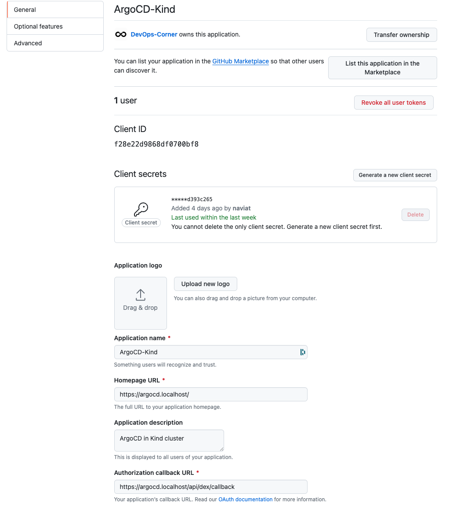

# Terraform in local kind-cluster

This document shows the way we use Terraform to provision kind-cluster in a local machine. It provides a local kind-cluster with pre-configured ArgoCD, logging, and monitoring (**separate helm chart, supposed to use Grafana LGTM stack but it will complicate the project, then just install Grafana, Loki, Prometheus**).

> You can view Terraform in detail at [terraform docs for this repository](./infras/terraform/modules/README.md).

> [!IMPORTANT]
> **For the ipToolkits application domain, the ingress controller is set with localhost automatically, [see more](https://github.com/naviat/ipToolkits/blob/main/infras/terraform/modules/values/ingress_controller.values.yaml). After deploying application by ArgoCD, you can access to the application by domain <https://iptoolkits.localhost>**

## Dependencies

- Terraform
- kubectl
- kind
- helm

## Installation

1. Update `/etc/hosts` to localhost domain we will use

    ```shell
    echo "127.0.0.1 monitoring.localhost argocd.localhost" | sudo tee -a /etc/hosts > /dev/null
    ```

1. Provision terraform

    ```shell
    cd infras/terraform/modules
    ./deploy.sh
    ```

1. Create your GitHub OAuth app from your organization (here is my DevOps-Corner Org)



1. Cleanup after finish

    ```shell
    cd infras/terraform/modules
    ./teardown.sh
    ```

After that, you can access to ArgoCD with: `https://argocd.localhost` and to Grafana with: `https://monitoring.localhost`
